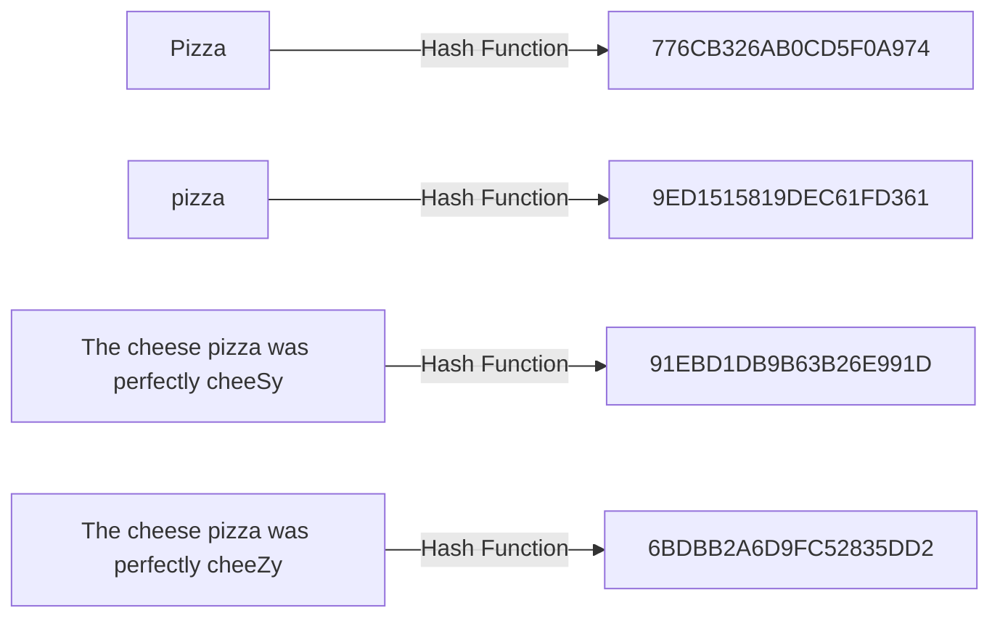
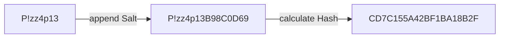

# Authentication

 

## Hash functions

<!---
// mermaid styles incase they are ever needed
style A fill:#1f2020,stroke:#81B1DB,stroke-width:1px,color:#FFFFFF
style B fill:#1f2020,stroke:#81B1DB,stroke-width:1px,color:#FFFFFF
style C fill:#1f2020,stroke:#81B1DB,stroke-width:1px,color:#FFFFFF
style D fill:#1f2020,stroke:#81B1DB,stroke-width:1px,color:#FFFFFF
style E fill:#1f2020,stroke:#81B1DB,stroke-width:1px,color:#FFFFFF
style F fill:#1f2020,stroke:#81B1DB,stroke-width:1px,color:#FFFFFF
-->

 

### Hashing a password

"*Hashing*" a password refers to using a plain text password as the input for a [hash function](https://en.wikipedia.org/wiki/Hash_function), which outputs a fixed-length string known as the "hash", "hash value" or more formally the "digest". No matter the size of the original string (i.e., the plain text password), the output (the hash) is always the same length. Since the same process is always applied, the same input always yields the same output.

For example:

- Say the plain text password is `P!zz4p13`. Every time `P!zz4p13` is passed into the hash function, the returned hash is the same.

- Say another plain text password is `Ch33z7Br3@d!` which happens to be 4 characters longer than `P!zz4p13`. Regardless of the password's length, the length of the hash produced for both passwords will be the same. The exact length depends on the algorithm.

Because hash functions always produce the same result for a specific input, they are predictable. This means an attacker could figure out the original password from the hash. In other words, hashing the password is not enough.

 

### Salting a password

A "*salt*" is a random string. By hashing a plain text password with a generated salt, the hash algorithm is no longer predictable. The same password, once hashed, will no longer yield the same hash again without using the same salt. Salts also help mitigate [hash table](https://en.wikipedia.org/wiki/Hash_table) attacks by forcing attackers to re-compute them using the salts for each user.

 

### Choosing a cryptographic hash function for storing passwords

To qualify as a [cryptographic hash function](https://en.wikipedia.org/wiki/Cryptographic_hash_function), the hashing algorithm must be "*pre-image resistant*" and "*collision resistant*".
	
- a hash function is pre-image resistant if it is computationally infeasible to find any input that hashes to a known output; i.e. given `y`, it is difficult to find an `x` such that `hash(x) = y`
	
- a hash function is collision resistant if it is highly-improbable that any two inputs share an identical hash

Rapidly evolving hardware must be accounted for especially when the length of passwords remain constant. Therefore, it is desirable for the hash function to take in parameters which allow adaptation to future faster hardware.

[Bcrypt](https://en.wikipedia.org/wiki/Bcrypt) is such a hash function. Bcrypt's salted hash meets current [cryptographic security standards for the web](https://cheatsheetseries.owasp.org/cheatsheets/Password_Storage_Cheat_Sheet.html#bcrypt) and is an optimal solution for storing passwords in a web application. 

#### Side notes and alternative hash functions
- Why bcrypt is [better than SHA256 for hashing passwords](https://codahale.com/how-to-safely-store-a-password/).
- [PBKDF2](https://en.wikipedia.org/wiki/PBKDF2) is the default recommendation by NIST and is used when FIPS-140 compliance is a constraint. However, bcrypt is preferred over PBKDF2 whenever possible as it holds up better with newer GPU/ASIC attacks under similar conditions.
- [Scrypt](https://www.tarsnap.com/scrypt.html) is designed to be more secure against hardware brute-force attacks than alternative functions such as PBKDF2 or bcrypt.
- [Argon2](https://en.wikipedia.org/wiki/Argon2) won the 2015 [Password Hashing Competition](https://www.password-hashing.net/) (PHC). Argon2id, one of the three Argon2 variants, is generally recommended as a better alternative to PBKDF2 or bcrypt for newer systems. 
- [Yescrypt](https://www.openwall.com/yescrypt/) is designed to be an improvement from scrypt and serves as an alternative to Argon2. Although yescrypt is not the 2015 PHC winner (Argon2 is), yescrypt was a finalist with "special recognition".

Choosing any of these algorithms to hash passwords is optimal in the general case. PBKDF2, bcrypt and scrypt are the most widely-used Password Hashing Schemes (PHS) and Key Derivation Functions (KDF) for mainstream applications ([according to this 2015 research paper](https://eprint.iacr.org/2015/265.pdf)). Argon2 is currently state-of-the-art.

We'll go with the battle-tested bcrypt and refrain from doing anything fancy for storing passwords. We could do better, but we won't.

 

### Bcrypt hash function

    hash = bcrypt(password, salt, workFactor)

where:
- `password` is a strong pasword
- `salt` is a long random unique value
- `workFactor` is the appropriate value that is relative to the hardware and security requirements
